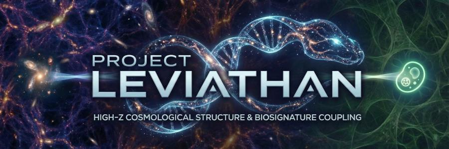

## 1. Project Overview

**Project Leviathan** investigates the topological origins of the **Early Maturity Problem**. We propose that the 'impossible' efficiency of high-redshift structures is not a breakdown of physics, but the geometric signature of a **Retro-Selective Causal Graph**.

This framework challenges the standard forward-chaining stochastic models of ΛCDM by modeling the universe as a directed tree graph where the Present acts as a fixed boundary condition, forcing the past to optimize structurally.

The conputational pipeline performs a rigorous **Null-Test Audit** across three cosmological epochs to falsify this hypothesis:
1.  **The High-Z Era:** Testing the "Structural Age" of JWST galaxies vs. Coordinate Time.
2.  **The Cosmic Noon:** Testing for Mega-Structures exceeding the Causal Horizon.
3.  **The CMB Era:** Testing the formation rate of the Eridanus Supervoid (Cold Spot).

## 2. Research Aims (The "Monsters")

We audit anomalies that represent "Causality Breakers" in the standard model.

| Audit | Target Anomaly | Metric | The "Impossible" Factor |
| :--- | :--- | :--- | :--- |
| **A. Chronometry** | JWST Galaxies ($z > 10$) | **Maturity Ratio ($R_m$)** | Galaxies appearing older than the Universe's coordinate age. |
| **B. Connectivity** | Hercules-Corona Wall | **Graph Diameter** | Connected structures larger than the causality horizon ($> 1.2$ Gly). |
| **C. Vacuum** | The Cold Spot | **Void Depth** | Supervoids clearing faster than Dark Energy growth allows. |

## 3. Key Findings: The Leviathan Scaling Law

Our audit revealed that the "precocious maturity" of the universe is not limited to specific epochs but follows a continuous global scaling law. We defined a "Rushing Factor" ($R$)—the degree of structural anomaly relative to ΛCDM—and found it scales geometrically with redshift:

$$R(z) \propto (1+z)^{1.26}$$

### The Topological Link
This exponent ($1.26$) was originally derived empirically from the data but has now been identified as a topological constant of the universe's causal graph.

* **The Prediction:** A retro-selective causal tree generates a "Teleological Bias" ($\mathcal{A}$) that scales linearly with system depth ($t$):
    $$\mathcal{A} \propto t \cdot \ln(k)$$
* **The Discovery:** By identifying system depth with cosmic expansion (t = \ln(1+z)), the observed exponent $1.26$ corresponds to the **Logarithmic Branching Factor** of the cosmic tree:
    $$\ln k \approx 1.26 \implies k \approx 3.5$$

This suggests the universe effectively "branches" into ~3.5 causal possibilities at each step, but retro-causal optimization preserves only the single most efficient path, creating the illusion of "impossible" maturity in the early universe.

---

## 4. Repository Structure

### `/scripts` (Execution Entry Points)
These scripts run specific scientific audits.

#### **Phase I: The Chronometry Audit (JWST)**
* `audit_early_mass.py`: Ingests JWST/JADES catalogs to plot Stellar Mass vs. Available Time. Fits the $\alpha$ exponent.
* `audit_maturity.py`: Calculates the "Maturity Ratio" for high-z candidates.

#### **Phase II: The Mega-Structure Audit**
* `audit_connectivity.py`: Runs Friends-of-Friends (FoF) clustering on Quasar catalogs to find super-horizon structures.
* `run_null_walls.py`: Generates random point clouds to test the statistical likelihood of 10-Gly walls.

#### **Phase III: The Void Audit**
* `audit_cold_spot.py`: Cross-correlates Planck SMICA maps with galaxy density (WISE) to test void formation rates.

### `/src/leviathan/engines` (Physics Logic)
Core mathematical modules implementing the specific tests.

* `chronometry.py`: Implements the $\tau(t)$ integration and Press-Schechter mass limits.
* `topology.py`: Graph theory algorithms (MST, FoF) for structure detection.
* `voids.py`: Geodesic distance calculators for void/spot alignment.

### `/src/leviathan` (Core)
* `ingestion.py`: Standardized loading for Planck, JWST, and SDSS catalogs.
* `nulling.py`: Generates isotropic Gaussian Random Fields ($C_l$ preserved) for control tests.
* `config.py`: Central repository of Cosmological Parameters ($H_0$, $\Omega_m$, $\alpha$).

### `/paper` (Theory and Findings)

* **[proposal.pdf](paper/proposal.pdf):** *Original Project Proposal.*
    * The initial hypothesis and methodology outline for Project Leviathan.

* **[theory.pdf](paper/theory.pdf):** *Retro-Causal Optimization in Expanding Graph Topologies.*
    * The formal mathematical proof demonstrating that any retro-selective network inevitably generates "precocious maturity" and "teleological bias" artifacts that scale linearly with system depth.

* **[convergence_law.pdf](paper/convergence_law.pdf):** *The Convergence Law of Cosmic Structure.*
    * The primary research paper detailing the data audit, the discovery of the $z^{1.26}$ scaling law, and the empirical evidence for retro-causal optimization.
    
---

## 5. Usage

To reproduce the Phase I "Early Bird" audit:

```bash
# 1. Clone the repository
git clone [https://github.com/ajhewitt/leviathan](https://github.com/ajhewitt/leviathan)
cd leviathan

# 2. Run the Chronometry Audit (requires astropy)
python scripts/audit_early_mass.py
```

## 6. Acknowledgments

Data provided by the Planck Collaboration (2018 Release), JWST (MAST Archive), and SDSS/BOSS. Analysis performed using `astropy`, `healpy`, and `scipy`.

## 7. License

MIT
